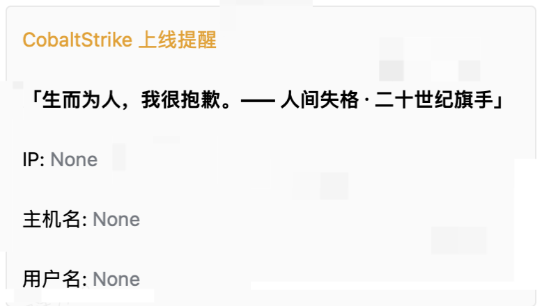
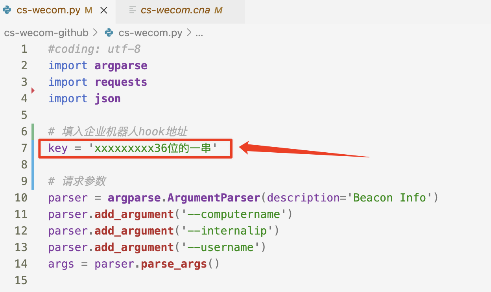

# CS-wecom

**通过 CobaltStike 服务端 / 客户端 挂载脚本，将上线主机信息通过企微机器人推送**

# 前言

有这个推送需求，企业微信也注册了，但还是觉得不给力，点开消息有点麻烦。

- Server酱要收费
- PushPlus感觉图标不好看
- 开源方案的企微消息推送到微信，觉着麻烦，从微信点开消息要点两次。
- .......

反正也就是改了一下脚步而已，也是想到了某z工具的提醒，用到了企业微信机器人。

原理很简单，调用企业微信机器人的api。

提醒方法很多，因人而异。之前很喜欢用**方糖**，logo也好看，微信提醒也实用。

> 如果想使用免费且支持微信模板消息推送的方式可以移步：[https://github.com/lintstar/CS-PushPlus](https://github.com/lintstar/CS-PushPlus)
> 
> 如果有订阅 ServerChan 的企业微信推送通道可以移步：[https://github.com/lintstar/CS-ServerChan](https://github.com/lintstar/CS-ServerChan)
>
> Cobalt Strike的多种上线提醒方法：[https://xz.aliyun.com/t/10698](https://xz.aliyun.com/t/10698)


## 可能遇到的困难

好像必须要两个人（**企业内）**以上的群聊才能创建企微机器人🤖️，所以自己发挥吧。

## 加入的一些功能

其实模版都是网上那个，我觉着固定话语太枯燥，加了个一言的api，自己每次看到上线信息的时候，能有新鲜感，虽说大半都是靶机和沙箱~~（bushi）~~。

```Bash
# 一言api接口
r = requests.get('https://v1.hitokoto.cn')
yiyan =json.loads(r.text).get('hitokoto') + '—— ' + json.loads(r.text).get('from')
```


# 效果




> 内容不满意，自己可定制。py脚本里随便改。


# 用法

1. 把`.py`文件和`.cna`文件都丢到cs服务端上
2. 修改`.py`文件中的`key`，注意是`key`，36位的
	
3. 修改`.cna`文件中**如图的绝对路径**，这个地方修改成py的绝对路径
	
4. cs目录下加载cna脚本
	用户注意不能重复，密码要是teamserver的那个连接密码。
	```Bash
	./agscript [host] [port] [user] [pass] </path/to/file.cna>
	```
	
	这里 agscript 的用法为：
	- [host] # 服务器的 ip 地址。
	- [port] # cs 的端口号，启动 cs 时有显示。
	- [user] # 后台挂载脚本时连接到 teamserver 的用户名。
	- [pass] # 启动服务端 cs 时设置的密码。
	- [path] # cna 文件的路径
